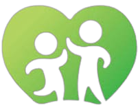
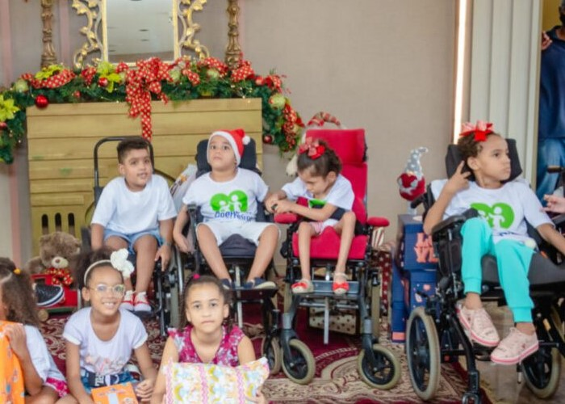

<h1 align="center">
  
  <br>
  Projeto Pequenos Guerreiros
</h1>

<p align="center">
  <strong>Website Institucional e Solidário para a ONG Pequenos Guerreiros</strong>
</p>

<p align="center">
  <a href="#-sobre-o-projeto">Sobre</a> •
  <a href="#-funcionalidades">Funcionalidades</a> •
  <a href="#-tecnologias">Tecnologias</a> •
  <a href="#-layout">Layout</a> •
  <a href="#-como-executar">Como Executar</a> •
  <a href="#-autor">Autor</a>
</p>

<div align="center">
  
</div>

<hr>

## 💚 Sobre o Projeto

Este projeto é um website desenvolvido para a ONG **Pequenos Guerreiros** (anteriormente "Príncipes e Princesas da Quimioterapia e Doenças Raras"). A organização, fundada por Adriana Guerra, atua no acolhimento e apoio a crianças e adolescentes (0 a 16 anos) em tratamento contra o câncer, doenças raras e deficiências.

O objetivo da plataforma é:
- **Divulgar** a história e as ações sociais da ONG (arrecadação de alimentos, visitas domiciliares, festas).
- **Acolher** novas famílias apresentando a missão, visão e valores do projeto.
- **Captar Recursos** através de uma vitrine de produtos solidários (pulseiras, laços, kits de festa), onde a renda é revertida para a causa.
- **Engajar** voluntários e parceiros através de formulários de contato.

---

## ⚙️ Funcionalidades

- [x] **Página Inicial (Home):**
  - **História:** Apresentação da trajetória da fundadora e do projeto.
  - **Slider Interativo:** Galeria de fotos automatizada (JavaScript) mostrando as crianças e eventos.
  - **Mascote:** Apresentação do "Quokkinha", o mascote símbolo de alegria e resiliência.
  - **Ações:** Detalhamento das atividades realizadas (doações, eventos).
- [x] **Catálogo de Produtos:**
  - Vitrine organizada por categorias (Acessórios, Kit Festa, Outros).
  - Exibição de itens como pulseiras artesanais, laços e decorações temáticas.
  - Botões de "Compre Aqui" direcionando para o contato direto (Instagram).
- [x] **Parceiros:** Área dedicada à divulgação das empresas e pessoas que apoiam a causa.
- [x] **Contato e Cadastro:**
  - Formulário para envio de mensagens.
  - Link externo para cadastro de novas crianças/famílias assistidas.
- [x] **Responsividade:** Layout adaptável para dispositivos móveis e desktops.

---

## 🚀 Tecnologias Utilizadas

O projeto foi construído utilizando tecnologias web fundamentais, garantindo leveza e compatibilidade:

- **[HTML5](https://developer.mozilla.org/pt-BR/docs/Web/HTML):** Estruturação semântica do conteúdo.
- **[CSS3](https://developer.mozilla.org/pt-BR/docs/Web/CSS):** Estilização visual, uso de Flexbox para layouts flexíveis e Media Queries para responsividade.
- **[JavaScript](https://developer.mozilla.org/pt-BR/docs/Web/JavaScript):** Implementação da lógica do carrossel de imagens (Slider) na página inicial.

---

## 🎨 Layout

O design utiliza a identidade visual da ONG para transmitir esperança e alegria.

### Cores Principais
- **Verde (#2d781e):** Cor primária, representando saúde, esperança e a marca "Pequenos Guerreiros".
- **Branco (#fff) e Cinza (#f5f5f5):** Utilizados para fundos e legibilidade do texto.

### Prévias

**1. Página Inicial com Slider**
> O slider destaca momentos especiais das crianças assistidas pelo projeto.


**2. Vitrine de Produtos Solidários**
> Área onde visitantes podem adquirir produtos para ajudar a manter o projeto.

*(Nota: Adicione um print da tela de produtos na pasta img com este nome ou ajuste o caminho)*

---

## 📂 Estrutura de Pastas

```bash
├── img/                  # Logotipos, ícones e fotos do projeto
│   ├── Slider/           # Imagens utilizadas no carrossel da home
│   └── ...
├── style.css             # Folha de estilos principal
├── script.js             # Lógica do Slider e interatividade
├── index.html            # Página Principal (Home)
└── produtos.html         # Página de Catálogo de Produtos
